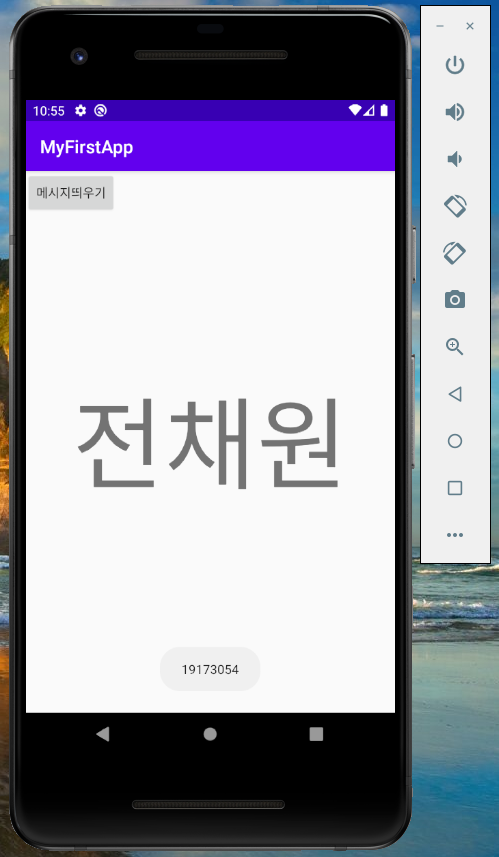
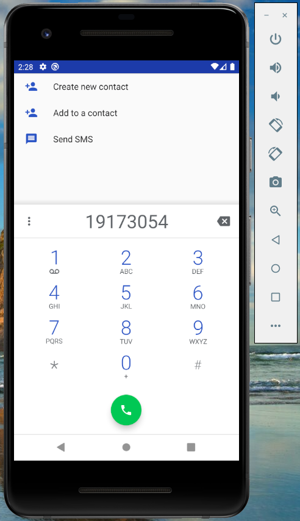
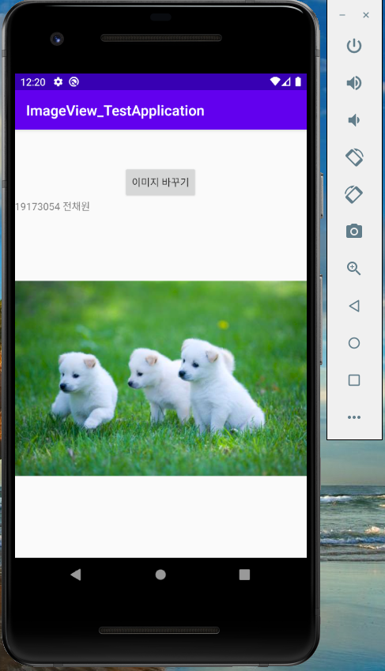
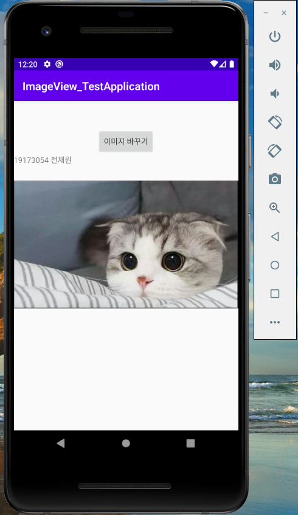

# 19173054 전채원

## 1주차 과제

## 2주차 과제
</img>

## 3주차 과제
</img>
</img>

## 4주차 과제

  - 앱 아이디어 이름 : 추억여행
  - 앱 아이디어 설명 : 대륙, 국가, 도시 등등 각각의 카테고리에 맞춰 여행 후기를 작성하여 해당 여행지를 추천하는 앱이다. 여행 후기 또한 관광지, 맛집, 숙소 등 다양한 카테고리에 맞춰 후기 작성 및 해당 장소 추천을 할 수 있도록 한다. 사진/동영상 업로드 기능을 활성화시켜 사용자들이 시각적인 컨텐츠를 다양하게 접할 수 있게 만든다. 또한 북마크 기능을 강조하여 다시 보고 싶은 포스트를 쉽게 찾을 수 있게 한다. 코로나로 인해 여행을 떠나지 못하는 사용자의 상황을 고려하여 후기 글을 작성함으로써 과거에 다녀왔던 여행을 추억할 수 있으며, 코로나가 종식된 이후에 어떤 장소로 무슨 여행을 떠날 지 계획을 세울 수 있는 정보를 제공할 수 있을 것이다.

## 5주차 과제

## 6주차 과제

## 7주차 과제
</img>
</img>
